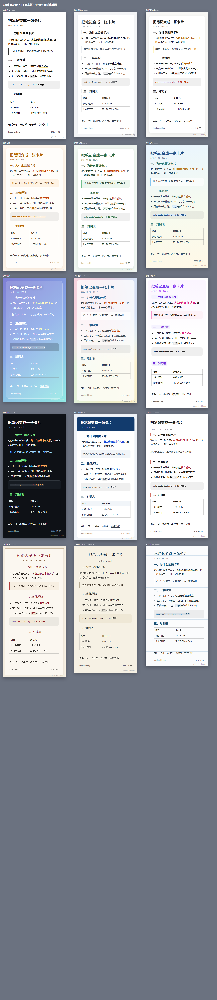

# Card Export

[English](#english) · [简体中文](#简体中文)

---

## English

Turn any note into a **share-ready card image**, straight from Obsidian. 15 themes, 5 canvas sizes, customizable background (solid / gradient / texture / image), author avatar and signature, and three export scopes.

Zero dependencies. It only ever **reads** your notes — it never rewrites them.



### Why another export-image plugin

[`obsidian-export-image`](https://community.obsidian.md/plugins/obsidian-export-image) is the established plugin in this space (66k+ downloads). It has watermarks, author info, 2× output, batch export and long-article splitting — but it ships **one look**. Changing the style means writing CSS against its internal DOM. It has also not been updated since February 2025.

Meanwhile the web-based card makers (md2card and friends) treat *style* as the product: 20+ themes, several canvas presets, automatic content splitting.

Card Export fills that specific gap: **styles are first-class citizens**, in a plugin that stays dependency-free and never touches your notes.

### 15 themes

`mono` Minimal Mono · `gray` Refined Gray · `memo` Apple Notes · `warm` Warm Soft · `fresh` Fresh Green · `dawn` Morning Field · `dream` Dream Gradient · `watercolor` Watercolor · `xhs` Purple Feed · `dark` Dark Tech · `biz` Business Brief · `japan` Japanese Magazine · `china` Chinese Classic · `typewriter` Retro Typewriter · `notebook` Lined Notebook

Themes are plain, readable CSS — one section per theme inside `main.js`. To tweak one without touching code, point the **custom CSS file** setting at any `.css` in your vault; it is appended after the theme.

### 5 canvas sizes

| id | size | notes |
|---|---|---|
| `long` | 620px wide, height follows content | the long-image format |
| `xhs` | 440 × 586 | Chinese social feed |
| `square` | 500 × 500 | square post image |
| `poster` | 440 × 782 | phone poster |
| `a4` | 595 × 842 | A4 print |

When content does not fit a fixed size, it is **split into several images at block boundaries**. If a single block is taller than a page, that page simply grows — **content is never clipped**.

### Three export scopes

| Command | What it exports |
|---|---|
| **Export note as card image** | the whole note (frontmatter stripped, H1 promoted to the card title) |
| **Export selection as card image** | just the text selected in the editor |
| **Export by headings as card images** | one image per `##` section; falls back to the whole note when there are no level-2 headings |

### Background customization

Beyond "follow the theme": **solid color**, **gradient** (7 presets), **texture** (5 presets — dots, grid, diagonal, ruled, noise), and **image** (any image in your vault). An optional **veil** (0–90, any color) sits on top so text stays readable over busy backgrounds.

Two details that matter: the noise texture is an inline SVG, and background images are **read into the exported PNG as data URLs** — the image you send someone carries its own background.

### Elements

Author avatar (round, from your vault), author name, a second line, source/account text in the metadata, toggles for date and word count, and a watermark (corner text or a full-width band).

### Output

| Button | Behaviour |
|---|---|
| **Save** | follows your settings: into the vault, additionally save as a file, copy to clipboard — any combination |
| **Save as…** | *always* opens the system save dialog, so you can drop the PNG on your Desktop (the last used folder is remembered) |
| Copy | clipboard, ready to paste into a chat |

If the environment cannot provide a save dialog (mobile), the plugin falls back to a small path prompt pre-filled with your Desktop — either way the file gets written.

### Install (manual)

1. Copy `main.js`, `manifest.json` and `styles.css` into `<your vault>/.obsidian/plugins/card-export/`.
2. Reload Obsidian (`Ctrl+P` → *Reload app without saving*).
3. Enable **Card Export** in *Settings → Community plugins*.

Not submitted to the community plugin list yet.

### Development

```
card-export/
├── main.js              the plugin (single file, no bundler, no runtime dependencies)
├── manifest.json
├── styles.css           UI styles for the export modal
├── versions.json
├── assets/themes-preview.png
└── tools/
    ├── test.mjs         pure-logic unit tests        (node tools/test.mjs)
    ├── preview.mjs      generates a preview page of all 15 themes
    ├── deploy.ps1       copy the plugin into a vault
    └── deploy.bat       double-click wrapper
```

```bash
node tools/test.mjs       # 97 assertions: themes, sizes, pagination, splitting, backgrounds, elements
node tools/preview.mjs    # writes tools/preview.html — open it to eyeball every theme
```

`main.js` is the source and the artifact at the same time — there is no build step.

### How it renders

Clone the card DOM → inline every computed style onto the clone (an SVG `<foreignObject>` cannot see the document's stylesheets) → embed it in `<foreignObject>` → draw onto a canvas → PNG. No third-party library (the reference plugin bundles `dom-to-image-more`, which is the same approach).

Known limitations, all inherent to that route:

1. **Desktop first.** Mobile is untested; WebKit (iOS) has poor `<foreignObject>` support.
2. **System fonts only.** The SVG cannot see `@font-face` fonts from your theme.
3. Images are inlined as data URLs, so exporting a note with many images is slower and uses more memory.
4. `backdrop-filter`, CSS animations and pseudo-element decorations are simplified or dropped in the export (layout is unaffected).

### License

No license file yet. MIT is the usual choice if you plan to submit to the community plugin list.

---

## 简体中文

把任意一篇笔记变成**可以直接发出去的卡片图片**。15 套主题、5 种画布尺寸、背景可自定义（纯色 / 渐变 / 纹理 / 图片）、头像与署名、三种导出范围。

零依赖。**只读笔记，从不改写**。

### 为什么要再做一个

[`obsidian-export-image`](https://community.obsidian.md/plugins/obsidian-export-image) 是这个方向的成熟插件（6.6 万+ 下载）：水印、署名、2× 输出、批量导出、长文切分都有，但**只有一种长相**——想换风格得对着它的内部 DOM 写 CSS；而且它从 2025 年 2 月之后就没再更新。

而网页版的卡片工具（md2card 这类）恰恰把「样式」当成产品本身：20 多套主题、若干画布预设、自动拆分。

Card Export 补的就是这一格：**把样式做成一等公民**，同时保持零依赖、不动笔记。

### 15 套主题

极简黑白 · 简约高级灰 · 苹果备忘录 · 温暖柔和 · 清新自然 · 清野晨光 · 梦幻渐变 · 水彩艺术 · 紫色小红书 · 暗黑科技 · 商务简报 · 日本杂志 · 中国传统 · 复古打字机 · 笔记本

主题就是一段可读的 CSS（在 `main.js` 里一套一段）。不想改代码也能微调：设置里指定一份**库内的自定义 CSS**，它会在主题之后追加生效。

### 5 种尺寸

自适应长图（620px 宽，高度随内容）/ 小红书 440×586 / 正方形 500×500 / 手机海报 440×782 / A4 打印 595×842。

固定尺寸装不下时，**按内容块边界自动切成多张**。单个块比一页还高时，那一页会变高——**绝不裁掉内容**。

### 三种导出范围

| 命令 | 导出什么 |
|---|---|
| **导出为卡片图片（整篇）** | 整篇笔记（去掉 frontmatter，H1 提为卡片标题） |
| **导出为卡片图片（选中的内容）** | 编辑器里选中的那一段 |
| **导出为卡片图片（按标题切成多张）** | 每个 `##` 小节一张；没有二级标题时退回整篇 |

### 背景自定义

除「跟随主题」外还有：**纯色**、**渐变**（7 个预设）、**纹理**（圆点/网格/斜纹/横线纸/噪点）、**图片**（库内任意图片）。另可加**遮罩**（0–90、任意颜色），背景花的时候保证文字可读。

两个细节：噪点纹理是内联 SVG；背景图片会被**读成 dataURL 内联进导出的 PNG**——发出去的图自带底图。

### 元素

头像（库内图片、圆形）、作者、补充说明、来源（显示在元信息里）、日期与字数开关、水印（角标或底部色带）。

### 输出方式

| 按钮 | 行为 |
|---|---|
| **保存** | 按设置执行：存进库 / 同时另存文件 / 复制到剪贴板，可任意组合 |
| **另存为…** | **总是**弹系统保存对话框，想存桌面就存桌面（会记住上次目录） |
| 复制 | 进剪贴板，直接粘进聊天窗口 |

拿不到系统对话框的环境（手机端）会退化成"手填完整路径"的输入框，默认已给到桌面——两条路都保证能写出来。

### 安装（手动）

1. 把 `main.js`、`manifest.json`、`styles.css` 复制到 `<你的库>/.obsidian/plugins/card-export/`；
2. `Ctrl+P` →「重新加载应用而不保存」；
3. 设置 → 第三方插件 → 启用 **Card Export**。

（暂未提交社区插件市场。）

### 开发

```bash
node tools/test.mjs       # 97 项纯逻辑单测
node tools/preview.mjs    # 生成 tools/preview.html，打开就能对比 15 套主题
```

`main.js` 既是源码也是产物，**没有构建步骤**。

### 渲染方式与已知限制

克隆卡片 DOM → 把计算样式**全部内联**到克隆节点（SVG 里看不到文档样式表）→ 塞进 `<foreignObject>` → 画到 canvas → PNG。不引第三方库（参考插件内置了 `dom-to-image-more`，是同一条路子）。

已知限制（都是这条路线的固有代价）：

1. **桌面优先**：手机端未验证，iOS 的 WebKit 对 `<foreignObject>` 支持差。
2. **只用系统字体**：SVG 读不到主题里的 `@font-face`。
3. 图片会内联成 dataURL，图多时更慢、更吃内存。
4. `backdrop-filter`、CSS 动画、伪元素装饰在导出图里会被简化或丢弃（不影响排版）。
